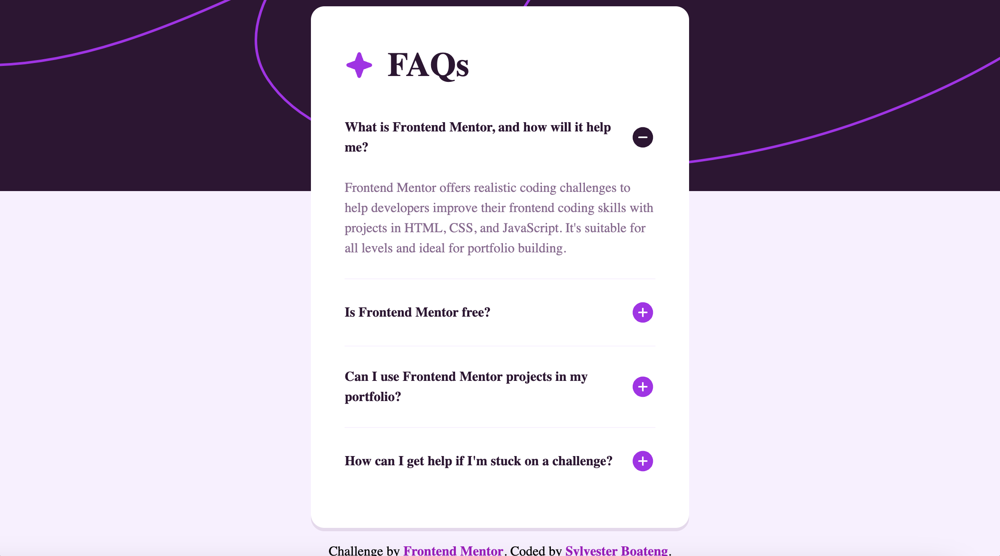

# Frontend Mentor - FAQ accordion solution

This is a solution to the [FAQ accordion challenge on Frontend Mentor](https://www.frontendmentor.io/challenges/faq-accordion-wyfFdeBwBz). Frontend Mentor challenges help you improve your coding skills by building realistic projects.

## Table of contents

- [Overview](#overview)
  - [The challenge](#the-challenge)
  - [Screenshot](#screenshot)
  - [Links](#links)
- [My process](#my-process)
  - [Built with](#built-with)
  - [What I learned](#what-i-learned)
  - [Continued development](#continued-development)
  - [Useful resources](#useful-resources)
- [Author](#author)
- [Acknowledgments](#acknowledgments)

## Overview

### The challenge

Users should be able to:

- Hide/Show the answer to a question when the question is clicked
- View the optimal layout for the interface depending on their device's screen size
- See hover and focus states for all interactive elements on the page

### Screenshot

### Links

- Solution URL: (https://github.com/sboateng12/faq-accordion)
- Live Site URL: (https://sboateng12.github.io/faq-accordion/)

## My process

### Built with

- Semantic HTML5 markup
- CSS custom properties
- Flexbox
- CSS Grid
- Javascript

### What I learned

This is my very first code with Javascript and it was overwhelming

### Continued development

I'd like to develop on my CSS3 and finally move on to Javascript

### Useful resources

- [The Odin Project](https://www.theodinproject.com/) - This is an amazing website which helped me finally understand HTML and CSS basics. I'd recommend it to anyone still learning this concept.

## Author

- Website - [Sylvester Boateng](https://github.com/sboateng12)
- Frontend Mentor - [@sboateng12](https://www.frontendmentor.io/profile/sboateng12)
- Twitter - [@sboateng76](https://twitter.com/sboateng76)

## Acknowledgments

I will like to thank the whole of Frontend Mentor Team for an amazing work they're doing out there and also to thank the Odin Project team for their hardwork and finally (https://github.com/preshpi) for putting me on the right path of my journey.
